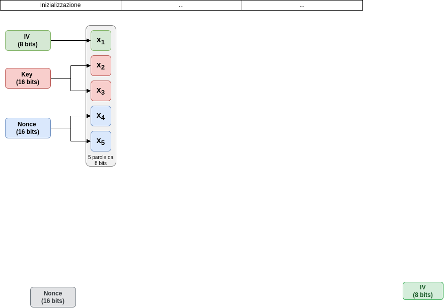

# ASCON 129f

Ascon-129f è una variante "toy" (didattica) dell'algoritmo Ascon-128a, il vincitore del progetto NIST per la crittografia leggera. Questo modello è progettato per fungere da laboratorio algebrico per l'applicazione del Cube Attack, permettendo lo studio della propagazione dei polinomi e del recupero dei superpoly in un contesto a complessità ridotta.

# Indice

* [Specifiche dell'architettura](#specifiche-dellarchitettura)
* [Stato interno e variabili](#stato-interno-e-variabili)
* [Permutazioni](#permutazioni)

---

## Specifiche dell'architettura
Il modello opera su uno stato ridotto, mantenendo però la struttura a Substitution-Permutation Network (SPN) tipica della famiglia Ascon.

> Una SPN (Substitution-Permutation Network) è una delle architetture fondamentali usate in crittografia per progettare i cifrari a blocchi simmetrici (come AES).

### Stato interno e variabili
Lo stato interno S è composto da 40 bit, organizzati in 5 parole da 8 bit ciascuna (anziché le 5 parole da 64 bit del modello Ascon 128a). $S=IV \parallel KEY \parallel NONCE$

- **IV** (Vettore di Inizializzazione): 8 bit costante specifica della variante dello standard
- **Key**: 16 bit variabile segreta
- **Nonce**: 16 bit variabile pubblica/controllabile dall'utente
- **Round Costant:** vettore di 12 elementi di 8 bit usati per il warm-up

    | Round ($i$) | 0 | 1 | 2 | 3 | 4 | 5 | 6 | 7 | 8 | 9 | 10 | 11 |
    | :--- | :---: | :---: | :---: | :---: | :---: | :---: | :---: | :---: | :---: | :---: | :---: | :---: |
    | **$RC_i$** | `0xF0` | `0xE1` | `0xD2` | `0xC3` | `0xB4` | `0xA5` | `0x96` | `0x87` | `0x78` | `0x69` | `0x5A` | `0x4B` |

## Permutazioni
Ogni round della permutazione è definito dalla composizione di tre strati: $p=p_l​\circ p_s​\circ p_c$​.

### Add Round Costant ($p_c$)
Il primo strato effettua l'operazione di XOR tra la costante di round RCi​ e la parola X3​ (la riga centrale dello stato): $X_3​\leftarrow X_3\oplus RCi$

### Substitution Layer ($p_s$)
Lo strato di sostituzione applica in parallelo 5 S-box su ogni colonna dello stato. Le funzioni booleane (ANF) che definiscono la S-box sono: 

$
X_1 \leftarrow X_2 \cdot X_5 \oplus X_4 \oplus X_2 \cdot X_3 \oplus X_3 \oplus X_1 \cdot X_2 \oplus X_2 \oplus X_1 \\
X_2 \leftarrow X_5 \oplus X_3 \cdot X_4 \oplus X_2 \cdot X_4 \oplus X_4 \oplus X_2 \cdot X_3 \oplus X_2 \oplus X_3 \oplus X_1 \\
X_3 \leftarrow X_4 \cdot X_5 \oplus X_5 \oplus X_3 \oplus X_2 \oplus 1 \\
X_4 \leftarrow X_1 \cdot X_5 \oplus X_5 \oplus X_1 \cdot X_4 \oplus X_4 \oplus X_3 \oplus X_2 \oplus X_1 \\
X_5 \leftarrow X_2 \cdot X_5 \oplus X_5 \oplus X_4 \oplus X_1 \cdot X_2 \oplus X_1
$

 ### Linear Diffusion Layer ($p_l$)
Lo strato di diffusione garantisce la dipendenza tra i bit delle parole tramite rotazioni cicliche e XOR. In Ascon-129f, le funzioni lineari $\Sigma_i$​ sono scalate per operare su parole ridotte:

$
X_1\leftarrow\Sigma_1(Y_1)=Y_1+(Y_1 >>>3)+(Y1 >>> 4)\\
X_2\leftarrow\Sigma_2(Y_2)=Y_2+(Y_2 >>>5)+(Y2 >>> 7)\\
X_3\leftarrow\Sigma_3(Y_3)=Y_3+(Y_3 >>>1)+(Y3 >>> 6)\\
X_4\leftarrow\Sigma_4(Y_4)=Y_4+(Y_4 >>>2)+(Y4 >>> 1)\\
X_5\leftarrow\Sigma_5(Y_5)=Y_5+(Y_5 >>>7)+(Y5 >>> 1)\\
$

